# Hi, I'm sanks 👋

**Full-Stack Engineer · AI Engineering · 3D GIS · UAV Systems**

I build complex, production-oriented systems across frontend, backend, 3D visualization, real-time communication, and AI applications.

My work focuses on connecting technologies into complete solutions — from Web interfaces and backend services to digital twins, UAV platforms, IoT, and intelligent systems.

> From frontend to backend, from 3D visualization to AI.

## 🧭 Focus

* 🌍 3D GIS & Digital Twin
* 🚁 UAV & Intelligent Inspection Systems
* 🤖 AI Agent, RAG & LLM Applications
* ⚡ Real-Time Web & IoT Systems
* 🏗️ Full-Stack Architecture
* ⚙️ Engineering & DevOps

## 🚀 Featured Projects

### [SkyTrace（天巡智控）](https://github.com/Inception-entry/skytrace-platform)

A full-stack intelligent UAV inspection platform integrating real-time flight operations, telemetry, AI analysis, alert workflows, and evidence auditing.

`Vue 3` `TypeScript` `Cesium` `Java` `Spring Boot` `Spring Cloud`
`NestJS` `FastAPI` `RAG` `MQTT` `RabbitMQ` `Temporal` `Docker`

---

### [Peregrine（游隼）](https://github.com/Inception-entry/peregrine)

A 3D GIS application built with Vue 3, TypeScript, and Cesium.

Includes map layers, spatial measurement, coordinate conversion, POI search, 2D/3D visualization, and 3D Tiles support.

`Vue 3` `TypeScript` `Cesium` `Vite` `Pinia`

---

### [Nighthawk（夜鹰）](https://github.com/Inception-entry/nighthawk)

A React and Node.js engineering project exploring modern frontend architecture and Monorepo development.

`React` `TypeScript` `Node.js` `Koa` `Turborepo` `pnpm`

---

### [Vue Tree Grid](https://github.com/Inception-entry/vue-tree-grid)

A tree-grid component for complex hierarchical data visualization.

Includes recursive rendering and virtual-list optimization for large datasets.

`Vue` `JavaScript` `Virtual List`

---

### [Utils](https://github.com/Inception-entry/utils)

A collection of reusable frontend utilities and development helpers.

`JavaScript` `Frontend Utilities`

## 🛠 Tech Stack

### Frontend

`Vue` `React` `TypeScript` `JavaScript`
`Cesium` `Three.js`

### Backend

`Java` `Spring Boot` `Spring Cloud`
`Node.js` `NestJS` `Koa`

### AI

`Python` `FastAPI` `RAG` `LLM` `AI Agent`

### Data & Messaging

`MySQL` `Redis` `RabbitMQ` `MQTT` `MinIO`

### Infrastructure

`Docker` `GitHub Actions` `Temporal`
`Prometheus` `Grafana`

## 🔭 Currently Exploring

* AI Agents for real-world engineering workflows
* RAG and LLM-powered applications
* UAV autonomous inspection systems
* 3D GIS and digital twin platforms
* Java + Node.js + Python service architecture
* AI-assisted software engineering

## 📊 GitHub

  
  

## 💡 Engineering Philosophy

I believe strong engineering is not about knowing more frameworks.

It is about understanding complex problems, designing maintainable architectures, connecting different technologies, and turning ideas into reliable systems.

